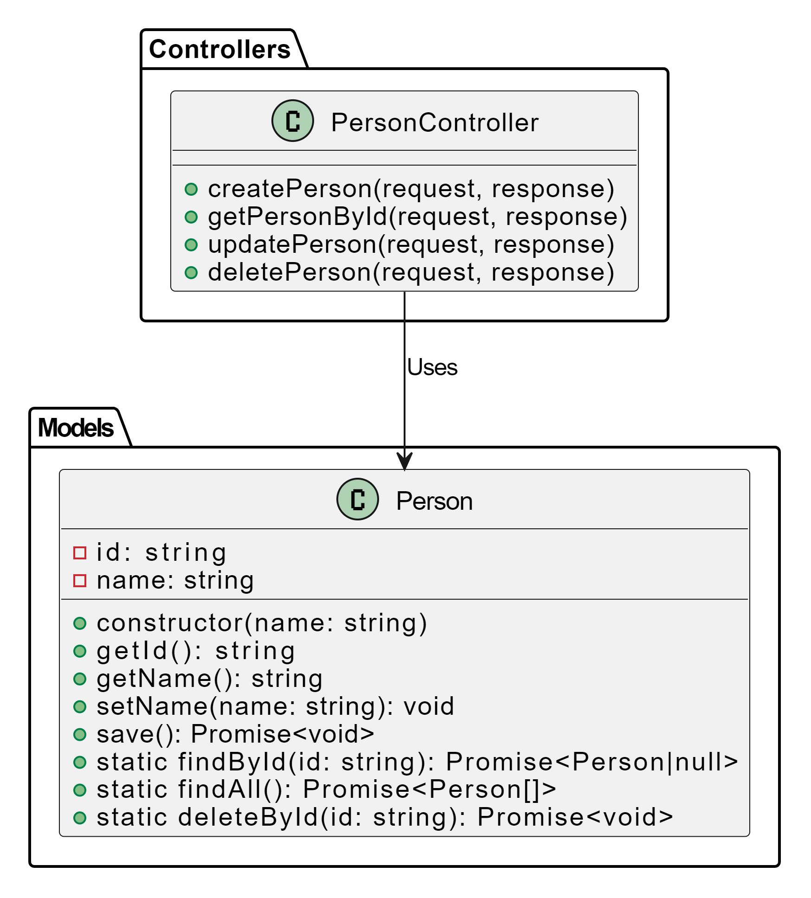

# Person Management API

The Person Management API allows you to create, read, update, and delete person records.

## Table of Contents

- [Prerequisites](#prerequisites)
- [Getting Started](#getting-started)
  - [Installation](#installation)
  - [Starting the Server](#starting-the-server)
- [API Endpoints](#api-endpoints)
  - [Create a New Person](#create-a-new-person)
  - [Read Details of a Person](#read-details-of-a-person)
  - [Update Details of a Person](#update-details-of-a-person)
  - [Delete a Person](#delete-a-person)
- [Sample Usage](#sample-usage)
- [Known Limitations](#known-limitations)

## Prerequisites

Before setting up and using the API, ensure you have the following:

- [Node.js](https://nodejs.org/) installed
- [MongoDB](https://www.mongodb.com/) installed and running
- [npm](https://www.npmjs.com/) (Node Package Manager) installed

## Getting Started

### Installation

1. Clone the repository:

   ```bash
   git clone https://github.com/Demmy100/hng_stage_two.git


The API will be accessible at http://localhost:4001/api.

## API Endpoints


## Create a New Person
Endpoint: POST /api

## Read Details of a Person
Endpoint: GET /api/:user_id

## Update Details of a Person
Endpoint: PUT /api/:user_id

## Delete a Person
Endpoint: DELETE /api/:user_id

## Limitations
The API does not include authentication or authorization. It assumes that the endpoints are accessible to anyone.


## UML Diagram Link
